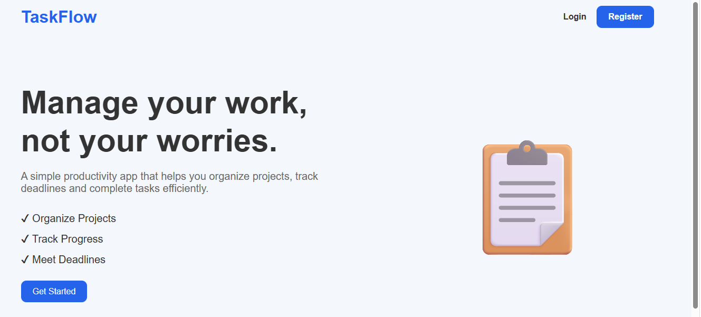
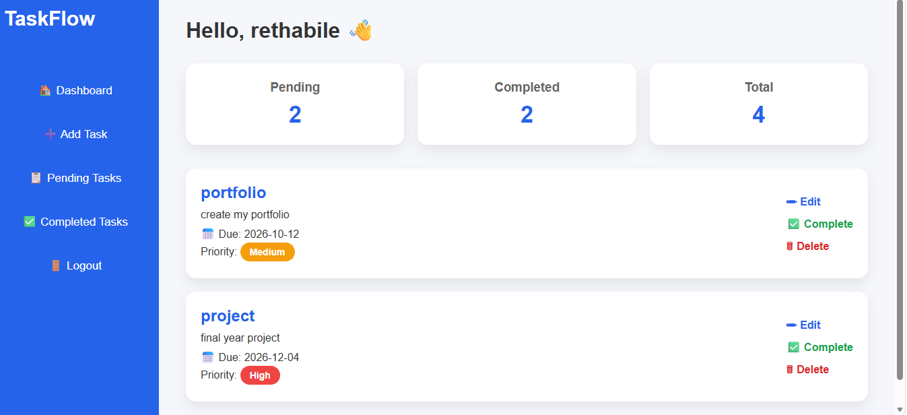
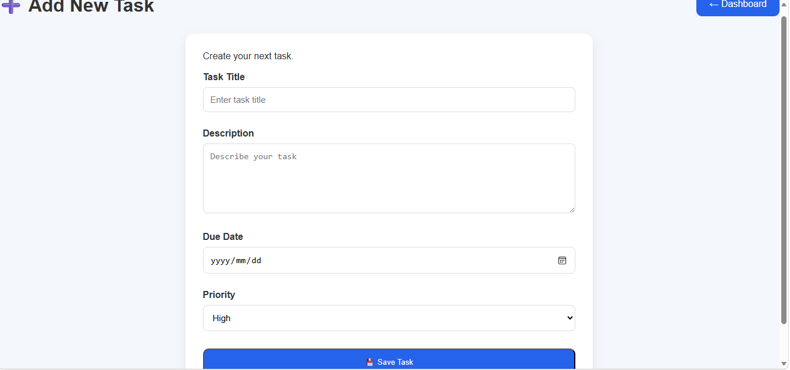
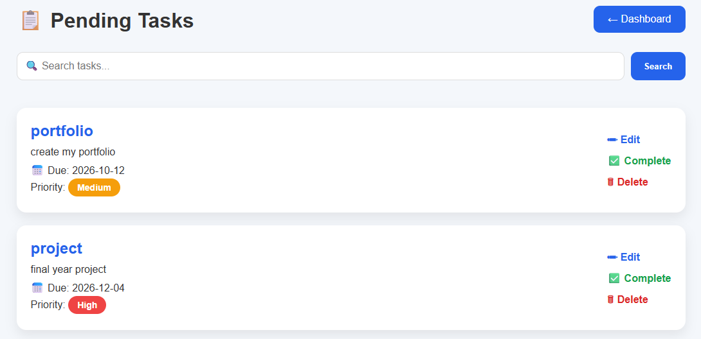
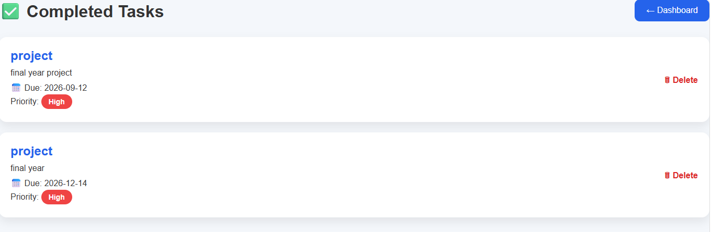

# 📋 TaskFlow

A modern task management web application built with **Flask** and **SQLite** that helps users organize tasks, track progress, and improve productivity through a clean and user-friendly interface.

# 🌐 Live Demo

https://taskflow-1x5n.onrender.com

# 💻 GitHub Repository

https://github.com/thabi1405/TaskFlow

# ✨ Features

- User registration and login
- Secure password hashing
- Add, edit and delete tasks
- Complete tasks
- Search tasks
- Dashboard statistics
- Responsive design

# 🛠 Technologies Used

- Python
- Flask
- SQLite
- HTML
- CSS
- Jinja2
- Git
- GitHub
- Render

# 📸 Screenshots

## Home Page



## Dashboard



## Add Task



## Pending Tasks



## Completed Tasks



---

# 🚀 Installation

Clone the repository

```bash
git clone https://github.com/thabi1405/TaskFlow.git
```

Go into the project

```bash
cd TaskFlow
```

Create a virtual environment

```bash
python -m venv venv
```

Activate it (Windows)

```bash
venv\Scripts\activate
```

Install dependencies

```bash
pip install -r requirements.txt
```

Run the application

```bash
python app.py
```
...

# 🔮 Future Improvements

- Email notifications
- Task reminders
- Categories
- Team collaboration
- PostgreSQL database
- Dark mode

...

# 👩‍💻 Author

Rethabile Mmako
BSc Mathematical Sciences Student

Majoring in Computer Science & Statistics